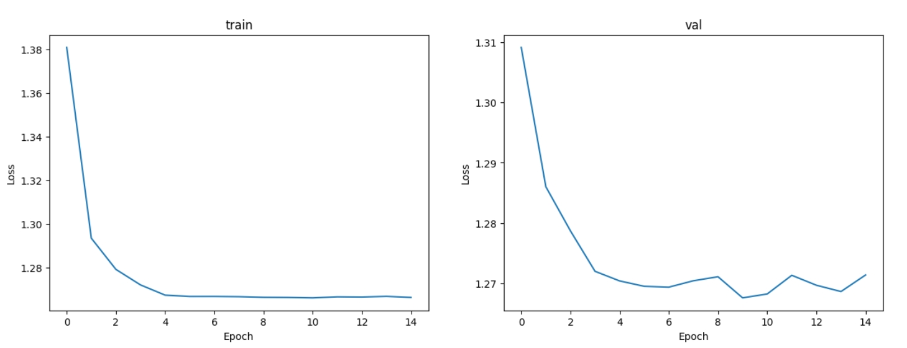
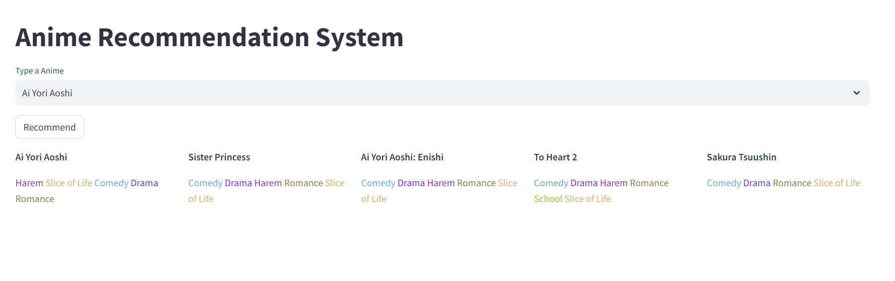

# recommendation_anime

## Purpose
Our project aims to recommend anime based on anime's info and users' preferences. Our dataset comes from kaggle(https://www.kaggle.com/datasets/hernan4444/anime-recommendation-database-2020). We plan to use three distinct approach to construct our recommendation system:

1. Naive Approach: Recommend the top k anime based on genre and scores. Users are allowed to input the genre they want to watch and the system would return the top k anime with the input genre with the highest scores.

2. Content-based filtering: We will use the anime's features genre to recommend similar anime based on the user's preference.

3. Neural network-based Collaborative filtering: We use the user_id and anime_id as our model's input, and we can get a predicted ratings list, then we choose top k animes from this list.

## Feature
- Collected a comprehensive dataset of anime from Kaggle, including anime title, genre, type, episodes, score, rating, etc. as well as user ratings for each anime.
- Implemented three recommendation systems through three different approaches: naive, machine learning (content-based filtering), and collaborative filtering (neural network-based).
- Provided extensive documentation and codebase for the models' training processes.
- Conducted a thorough evaluation and comparison of model outputs.

### Model Train

#### 1. Naive Approach

The naive approach is to recommend the top k anime based on genre and scores. Users are allowed to input the genre they want to watch and the system would return the top k anime with the input genre with the highest scores. The score feature was already used in the dataset.

#### 2. Machine Learning Approach (Content-based filtering)
The content-based filtering approach is to get predicted rating for a user-anime pair, and it can also generate top k animes recommendation for a certain user in our database. We use 20 percent of the dataset as the test set to test the accuracy of predicting ratings for a given user-anime pair. The final RMSE for the model is 1.797.

#### 3. Deep Learning Approach (NCF - Neural Network-based Collaborative Filtering)

The NCF model typically consists of two parts: User Embedding and Item Embedding. User Embedding and Item Embedding represent the features of users and items by mapping them into low-dimensional vectors in space. These vectors are input into a neural network, which combines them to generate recommendation results.

The NCF model usually includes multiple hidden layers and activation functions to learn the nonlinear relationships between users and items. The model can adopt different neural network architectures, such as Fully Connected Neural Networks (FCN) or Multi-Layer Perceptrons (MLP), to adapt to various recommendation tasks and datasets.

In our task, we firstly use one-hot-encode to encode all 47 genres in the dataset, then we build a deep neural network based on the original NCF network and revised it(remove the original nn.Embedding and add nn.Linear layer).

The training process is showed in the following image:

### Model Evaluation

Get the most similar anime for the current anime among all animes in the history and use the rating for that anime as the final rating for the predicted anime.

| model | RMSE |
|-------|-------|
| Neural Network-based Collaborative Filtering | 1.281 |
| Content-based filtering | 1.797 |

### Web Interface
